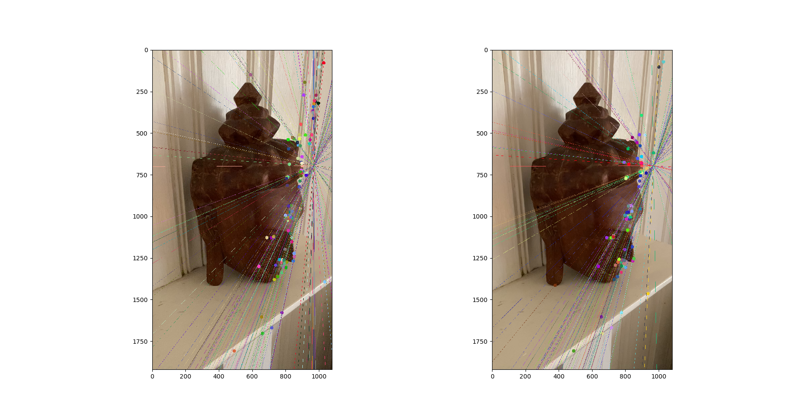
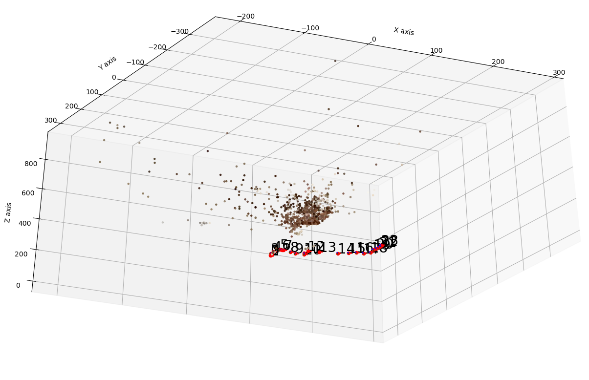

# Bundle-adjustment-on-Phone-images
Performed sparse reconstruction and bundle adjustment on a buddha figure

## Overview
Structure from Motion (SfM) was a computer vision technique that reconstructed a 3D scene from a set of 2D images. The algorithm aimed to recover the 3D structure of a scene and the camera poses from a series of images.

**Keypoint Calculation and Non-Maximum suppression:**
   - For feature detection, we use the SIFT detector to detect features in consecutive frames. tests were done using Superpoint as well but the results were fairly similar.
   - We performed Non-maximum suppression as well to avoid the same feature being matched to multiple features in different images.

**Feature Matching and Outlier Rejection using RANSAC:**
   - To match the features we used a brute force matcher with Lowe's ratio. tests were done using SuperGlue but the results were very similar.
   - Utilized the Random Sample Consensus (RANSAC) algorithm to robustly match these features across images.


**Estimating Essential Matrix and Fundamental Matrix:**
   - Calculated the fundamental matrix using the epipolar constraints and RANSAC was applied to detect noisy matches.
   - Derived the Essential Matrix from the Fundamental Matrix by incorporating camera intrinsic parameters.
   - The Essential Matrix encapsulated information about the relative pose of the cameras.
<p>
  
</p>

**Estimate Camera Pose from Essential Matrix:**
   - camera poses (rotation and translation) were extracted from the Essential Matrix.
   - Recovered the motion of the camera in relation to the scene.

**Check for Cheirality Condition using Triangulation:**
   - Ensured that the reconstructed points lie in front of both cameras by applying the chirality condition.
   - Discarded points violating this condition as they may be behind one of the cameras.

**Perspective-n-Point:**
   - Utilized the Perspective-n-Point (PnP) algorithm to estimate the 3D position of the matched points in the world coordinates.
   - This step refined the initial camera poses obtained from the Essential Matrix.

**Bundle Adjustment (using GTSAM):**
   - Optimized the entire reconstruction by jointly refining camera poses and 3D points.
   - Leveraged the Generalized Trajectory Optimization (GTSAM) library for efficient bundle adjustment.

<div>
     Plotting camera poses after bundle adjustment (GTSAM):
     <br>
     
</div>

To view the results run the ```bundle_adjustment.ipynb``` file

```old_legacy.ipynb```: This is First version of bundle adjustment